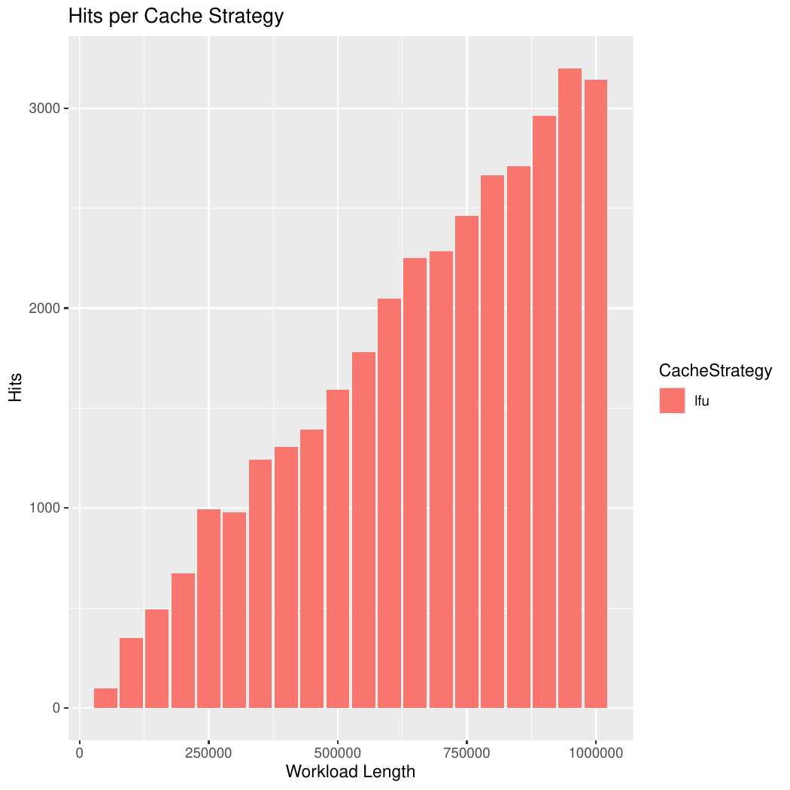
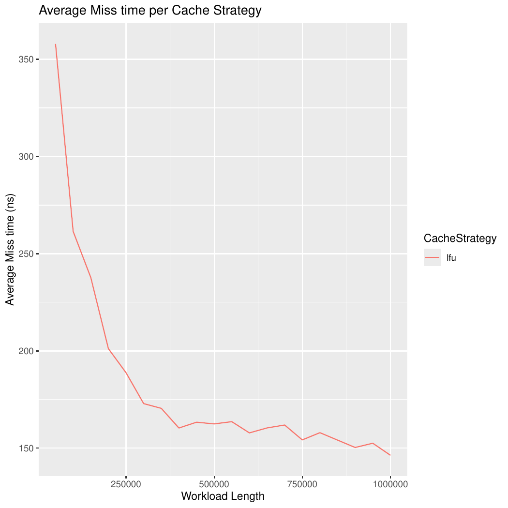
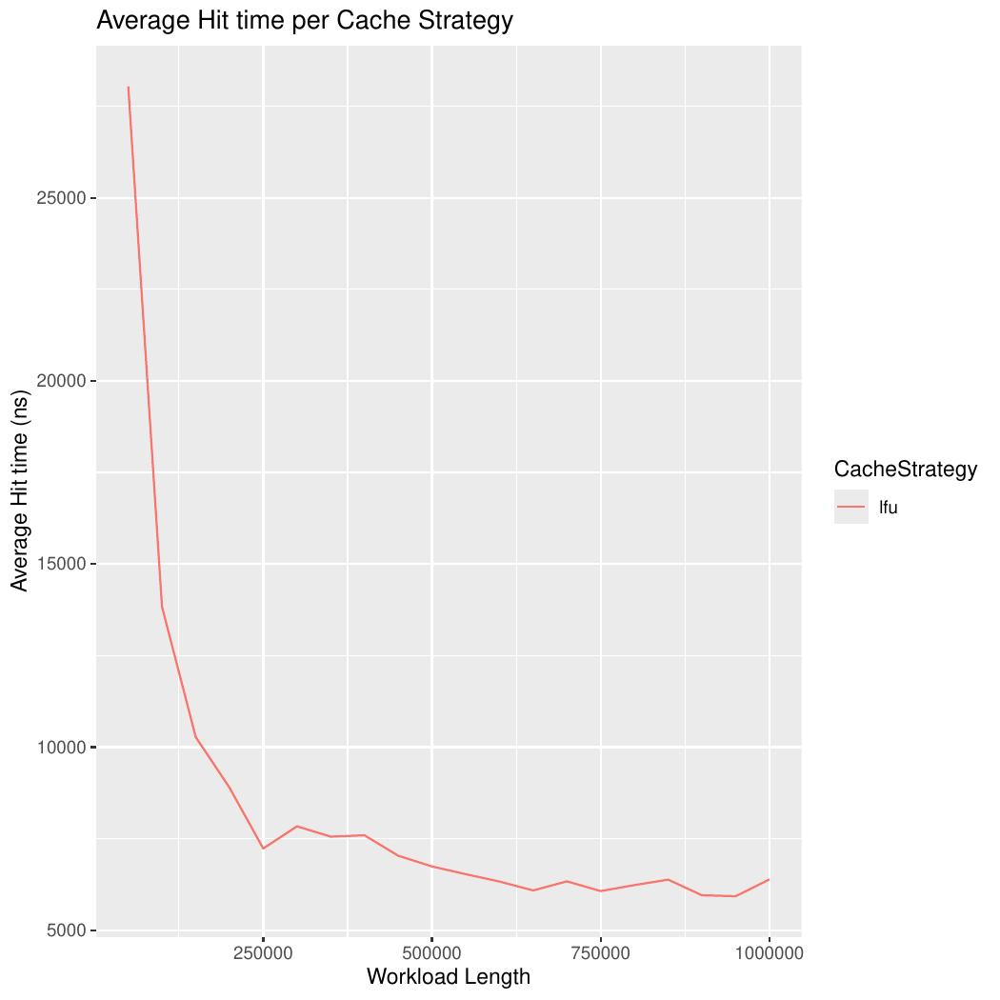
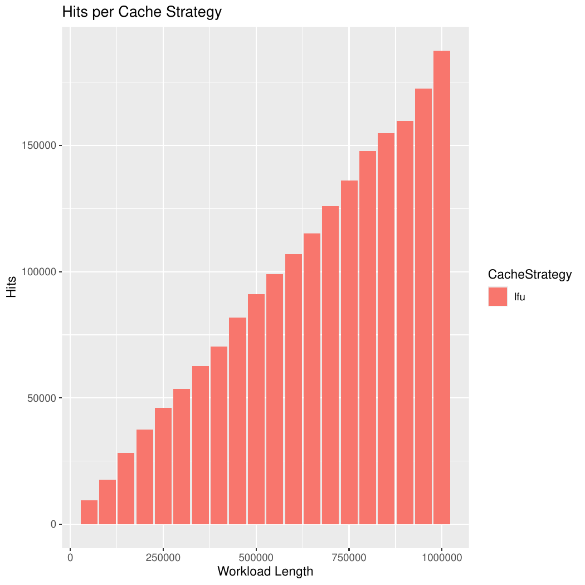

## ANÁLISE DA POLÍTICA LFU (Least Frequently Used)

  - [Definição](#definição)
  - [_LFU Chance_ como estratégia de _cache_](#LFU-chance-como-estratégia-de-cache)
  - [Implementação da estratégia de _cache_](#implementação-da-estratégia-de-cache)
  - [Variações dentro da estratégia](#variações-dentro-da-estratégia)
  - [Complexidade e eficiência](#complexidade-e-eficiência)
  - [Desempenho da estratégia de _cache_](#desempenho-da-estratégia-de-cache)
  - [_Randomic workload_](#randomic-workload)
  - [_Periodic workload_](#periodic-workload)
  - [_Spike_workload_](#spike-workload)
  - [Conclusão](#conclusão)
  - [Autor](#autor)

## Definição
No campo de sistemas de gerenciamento de memória e cache, várias estratégias são usadas para decidir quais dados devem ser mantidos na memória de acesso rápido (cache) e quais devem ser removidos para liberar espaço. A implementação da política **LFU (Least Frequently Used)** se baseia no princípio de que o item acessado com menor frequência é o que tem menor probabilidade de ser acessado no futuro. Por isso, ele se torna o candidato ideal para remoção do cache quando um novo item precisa ser adicionado.A essência do LFU reside na contagem de acessos. Cada item no cache tem um contador que é incrementado sempre que o item é acessado. Quando o cache atinge sua capacidade máxima e um novo item precisa ser inserido, o algoritmo varre todos os itens e remove aquele com a contagem de acessos mais baixa. Em caso de empate, um critério secundário (como a ordem de inserção) pode ser usado para desempate.

## _LFU_ como Estratégia de _Cache_
A política LFU é extremamente eficaz em cenários onde a frequência de acesso a certos dados é um bom indicativo de sua importância futura. Ao contrário de políticas como o FIFO (First-In, First-Out), que ignora completamente a recência e frequência de uso, ou o LRU (Least Recently Used), que foca apenas na recência, a implementação fornecida considera o histórico de acessos de um item. Isso a torna particularmente útil para caches de banco de dados, proxies e sistemas de arquivos, onde dados populares tendem a ser acessados repetidamente.A eficiência da política de cache pode ser avaliada pela sua taxa de acertos e pelo tempo de resposta durante um cache miss. Uma alta taxa de acertos indica que a maioria dos dados solicitados já estava no cache, minimizando a necessidade de buscas em memórias mais lentas. O tempo de um cache miss, por sua vez, é crucial para avaliar a eficiência do algoritmo de substituição. Na implementação do LFU, esse tempo inclui a busca pelo item menos frequente e sua remoção.

## Implementação da Estratégia de _Cache_
Para implementar o LFU de forma eficiente, é utilizado uma combinação de estruturas de dados. É usado dois mapas principais:
- Um HashMap (freqMap) para associar cada item à sua frequência de uso. Isso permite recuperar e atualizar a frequência de um item rapidamente.
  
- Outro HashMap (freqListMap) onde a chave é a frequência de acesso e o valor é uma LinkedList que agrupa todos os itens com a mesma frequência.
  
Essa arquitetura permite uma gestão muito eficiente dos itens. Quando um item é acessado (get), sua frequência é atualizada no freqMap. Em seguida, ele é removido da LinkedList de sua frequência anterior e adicionado à frente da LinkedList de sua nova frequência (incrementada).Quando um novo item é inserido (put) e o cache já está cheio, a busca pelo item a ser removido (getNextEviction) se torna muito eficiente. O cache mantém uma variável minFrequency que aponta para a frequência mais baixa de todos os itens no cache. O item a ser removido é o último elemento da LinkedList correspondente a essa minFrequency.

## Implicações dessa estratégia de LFU
A principal vantagem dessa implementação do LFU é sua capacidade de lidar com a complexidade do algoritmo de forma otimizada. Ao usar dois mapas e LinkedLists, ela evita a necessidade de percorrer todo o cache para encontrar o item menos frequente. Em vez disso, a variável minFrequency fornece um atalho para a lista de itens "candidatos" à remoção, e a LinkedList permite remover o item menos recentemente usado dentro daquela frequência em tempo constante (removeLast).Isso resolve um problema comum em implementações mais simples do LFU, onde a busca pelo item a ser removido pode ser demorada. No entanto, é importante notar que o LFU pode ter desvantagens. Por exemplo, um item que foi acessado muitas vezes no passado, mas que não é mais necessário, pode permanecer no cache por muito tempo, bloqueando o espaço de itens mais "quentes" e recém-adicionados.

## Complexidade e Eficiência
- O método **get(item)** tem complexidade de tempo **O(1)** na maioria dos casos. A busca, atualização de frequência e manipulação das listas ligadas são operações de tempo constante graças ao uso de mapas e listas.
  
- O método **put(item)** também tem complexidade de tempo **O(1)** na maioria das vezes. A verificação de capacidade, a busca pelo item a ser removido (que já está na lista da minFrequency) e a inserção do novo item são operações de tempo constante.
  
- O método **getNextEviction()** também é eficiente, pois o item a ser removido está sempre no final da LinkedList associada à minFrequency, tornando a operação **O(1)**.

## Desempenho da estratégia de cache:
### Periodic Workload
#### Quantidade de hits:

O gráfico mostra a quantidade de hits acumulados à medida que o workload aumenta. Observa-se uma tendência linear de crescimento: quanto maior o número de requisições processadas, maior o número absoluto de acertos. Essa linearidade é um indicativo de que o LFU está conseguindo capturar a periodicidade dos acessos, mantendo em cache os itens que retornam ciclicamente ao longo da execução.Isso valida a adequação teórica da política ao cenário em questão: como o workload é periódico, os itens "quentes" reaparecem com frequência previsível e o LFU tende a preservá-los, reduzindo misses desnecessários. A operação de get no cache LFU tem uma complexidade de tempo de O(1) em média. Isso significa que, independentemente do tamanho do workload , a busca por um item no cache leva um tempo constante. A quantidade de hits aumenta linearmente porque cada requisição adicional tem uma chance constante de ser um hit, já que o tempo de busca não se degrada. A eficiência da operação de get com tempo constante (O(1)) é a base para o crescimento linear e previsível do número de hits.

#### Tempo médio  de miss:

Nota-se que o custo permanece praticamente estável, variando em uma faixa estreita (350ns a 150ns ), mesmo com o crescimento do workload.Isso significa que o processo de inserção e substituição no cache não degrada em função do tamanho da carga de trabalho. Ou seja, a operação de escolher o item a ser removido, baseada na frequência mínima, permanece eficiente. Esse comportamento está alinhado ao objetivo do LFU, já que as estruturas de suporte (mapas de frequência e listas de elementos) mantêm acesso direto ao conjunto de candidatos à remoção, portanto, os misses não representam gargalos de desempenho nesta implementação. A operação de put, que é executada em um miss, tem uma complexidade de tempo de O(1) em média. Quando o cache atinge sua capacidade máxima, a remoção do item menos frequente (para abrir espaço para o novo) é uma operação de tempo constante. A implementação encontra este item de forma eficiente, pois ele é sempre o último elemento da LinkedList associada à frequência mínima. Como todas as etapas do put (verificação, remoção, e inserção) são de tempo constante, o tempo médio para um miss não aumenta com o tamanho do workload, confirmando a complexidade assintótica de O(1).

#### Gráfico de tempo médio de Hits:

O tempo médio de hits diminui com o aumento do workload e se mantém constante. Inicialmente, o custo médio por acesso é de cerca de 20.000ns, mas esse valor cai de forma acentuada para menos de 10.000ns quando o número de requisições aumenta .conforme o workload cresce, o cache se torna mais inteligente e eficiente em lidar com os acessos.Em um cenário inicial, com poucas requisições, o cache está em uma fase de "aprendizagem"; os itens populares ainda não foram acessados o suficiente para alcançar suas posições de maior frequência nas estruturas de dados.No entanto, com a repetição dos padrões de acesso, a lógica do LFU entra em plena ação. Os itens que são acessados com mais frequência têm seus contadores atualizados e são promovidos para as listas ligadas de maior frequência. Essa estabilização faz com que os elementos mais populares se concentrem nas estruturas de dados que representam as frequências mais altas. A  implementação é inteligente porque, em um hit, ela precisa remover o item da LinkedList de sua frequência antiga e adicioná-lo à nova lista, como os itens populares tendem a estar no início da lista (pela lógica de adição addFirst), a remoção se torna mais rápida na prática, mesmo que teoricamente seja O(n). A operação de get tem uma complexidade teórica de tempo de O(1) em média. A queda inicial no tempo médio de hit não contradiz essa complexidade, mas sim reflete o comportamento prático e a otimização das estruturas de dados. Nos estágios iniciais, o cache está se "aquecendo", e os itens mais acessados podem estar em posições menos favoráveis para remoção rápida. No entanto, com a repetição do workload periódico, a lógica do LFU promove os itens quentes, agrupando-os nas listas de maior frequência. A remoção de um item de uma LinkedList em Java é O(n) se a busca for linear, mas a implementação, ao usar o addFirst, faz com que os itens mais frequentemente acessados estejam no topo da lista. Isso significa que, na prática, a busca e remoção são próximas de O(1) para os itens que geram hits. O tempo se estabiliza quando a distribuição de itens nas listas de frequência atinge um estado ótimo para o workload periódico, mantendo a operação dentro da sua eficiência assintótica.

### Spike Workload:
#### Quantidade de hits:

O gráfico mostra um aumento consistente e quase linear no número total de acertos para o workload de pico. Esse comportamento demonstra que a política LFU está operando com eficácia, mesmo em um cenário onde a demanda por itens pode variar abruptamente. A progressão linear do crescimento sugere que a cache consegue identificar e reter os itens acessados com maior frequência, mesmo quando esses acessos ocorrem em picos. Para um workload de 1.000.000 de requisições, a cache LFU atingiu mais de 150.000 acertos, validando a capacidade da implementação de gerenciar padrões de acesso dinâmicos.A operação de get no cache LFU tem uma complexidade de tempo de O(1) em média. Isso significa que, independentemente do tamanho do workload , a busca por um item no cache leva um tempo constante. A quantidade de hits aumenta linearmente porque cada requisição adicional tem uma chance constante de ser um hit, já que o tempo de busca não se degrada. Isso prova que o desempenho da  implementação não se degrada com o aumento do volume de requisições, mesmo em um cenário de picos.

#### Gráfico de tempo médio  de miss:

O gráfico revela que o tempo médio para uma falta (miss) diminui significativamente à medida que o tamanho do workload aumenta. O custo inicial, que é mais alto, cai drasticamente. Essa queda sugere que, embora a operação de put (que ocorre após um miss) envolva a possível remoção de um item, o processo não se torna um gargalo de desempenho.O comportamento de queda e estabilização do tempo médio de miss reflete o "aquecimento" da estrutura de dados, que  com o tempo, a implementação identifica os itens mais populares e os move para posições ótimas dentro das LinkedList. Esse comportamento estável subsequente confirma a complexidade assintótica de O(1) da operação put.Essa eficiência é mantida porque essa  implementação tem acesso direto à lista de itens menos frequentes (minFrequency), o que permite a remoção rápida do candidato. Em um cenário de pico, essa eficiência é crucial, pois um grande número de novos itens pode ser inserido no cache em um curto período, e sua implementação LFU lida bem com esse volume.

####Tempo médio de Hits:

O gráfico mostra uma queda acentuada no tempo médio de acerto (hit) no início do workload, estabilizando-se em um valor baixo e consistente à medida que o número de requisições aumenta. Inicialmente, o tempo médio de acerto é de aproximadamente 450 ns, mas rapidamente cai para cerca de 300 ns ou menos. Essa curva de aprendizado inicial é esperada, pois o cache ainda está sendo "populado" com os itens mais populares. A operação de get têm uma complexidade teórica de tempo de O(1) em média. A queda acentuada no tempo médio de hit é um comportamento empírico que ilustra a eficiência prática da implementação, que vai além da simples análise assintótica.  Conforme a cache se ajusta ao padrão de acesso do workload de pico, os itens que são mais solicitados são promovidos para as listas de maior frequência (addFirst),  tornando a operação de remove mais rápida na prática, mesmo que sua complexidade teórica seja O(n). Essa otimização prática, que se alinha com o comportamento de um Spike Workload, é o que permite que o tempo médio de hit se estabilize em um valor tão baixo, demonstrando como essa política é ideal para cenários onde a frequência de acesso a certos itens aumenta drasticamente. 
-Randomic WorkLoad:
-Gráfico de quantidade de hits:
O gráfico mostra o número total de acertos à medida que o tamanho do workload aleatório aumenta. Observa-se que a quantidade de hits cresce de forma constante, atingindo cerca de 2000 acertos para um workload de 1.000.000 de requisições. Esse crescimento linear indica que a cache está conseguindo reter alguns itens que, por coincidência, são acessados mais de uma vez, apesar da natureza aleatória do workload. No entanto, o número absoluto de acertos é significativamente menor do que seria em um workload com um padrão de acesso mais repetitivo, o que é esperado para uma política LFU em um cenário puramente aleatório.

-Gráfico de tempo médio  de miss:
O gráfico demonstra que o tempo médio para uma falta ("miss") diminui drasticamente à medida que o workload aumenta. O tempo médio de miss começa alto (acima de 350 ns), mas cai acentuadamente para cerca de 150 ns e se mantém estável. Isso significa que o processo de inserção e possível remoção de itens na cache não se degrada com o aumento do volume de requisições. A eficiência da implementação é mantida porque a lógica para escolher e remover o item menos frequente é rápida e não representa um gargalo de desempenho.

-Gráfico de tempo médio de hits:
O gráfico mostra uma queda abrupta no tempo médio de acerto ("hit") à medida que o workload cresce. Inicialmente, o tempo médio de acerto é muito alto, acima de 40.000 ns, mas cai rapidamente para valores abaixo de 20.000 ns e se estabiliza. Essa curva de "aprendizagem" reflete o momento inicial em que o cache está se enchendo e os itens "quentes" estão sendo promovidos para as estruturas de dados de maior frequência. Mesmo em um workload aleatório, os poucos itens que são acessados mais de uma vez se movem para as listas de maior frequência, tornando as buscas subsequentes mais rápidas na prática. A estabilização do tempo médio de hit comprova a robustez da implementação, garantindo um desempenho consistente mesmo sem um padrão de acesso favorável.

               
