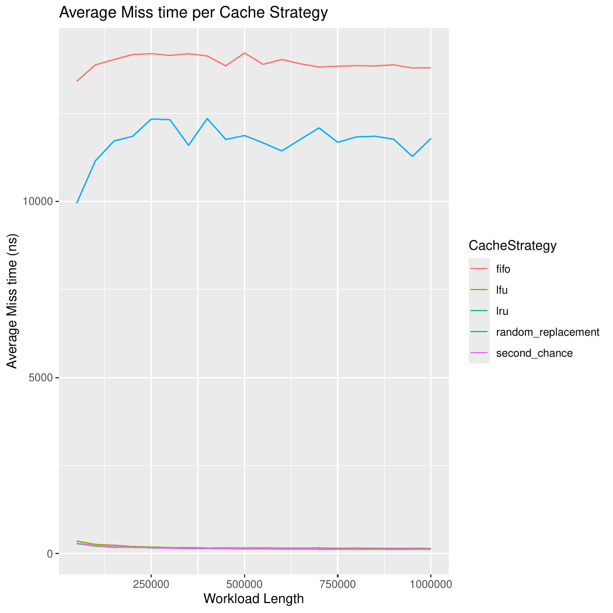

# _LRU Eviction Strategy_

 - [Definição](#definição)
 - [Aplicação da LRU](#aplicação-da-lru)
 - [Desempenho da estratégia de cache](#desempenho-da-estrategia-de-cache)
 - [_Periodic Workload_](#periodic-workload)
 - [_Randomic Workload_](#randomic-workload)
 - [_Spike Workload_](#spike-workload)
 - [Conclusão](#conclusão)
 - [Autor](#autor)
 
## Definição
A política de cache LRU (Least Recently Used) é uma estratégia de substituição de cache baseada no princípio da localidade temporal, onde dados acessados recentemente possuem maior probabilidade de serem reutilizados em um futuro próximo.

Como o nome sugere, quando a memória cache esta cheia, a LRU escolhe os dados usados menos recentemenete e so remove para liberar espaço para os novosdados. A prioridade dos dados no cache muda de acordo com a necessidade desses dados, ou seja, se alguns dados forem buscados ou atualizados recentemenete, a prioridade desses dados será alterada e atribuída à prioridade mais alta, e a prioridade dos dados diminui se permanecerem operações não utilizadas após operações.

### Características FUndamentais:

 - **Criterio de Substituição:** Remove sempre o elemento que permaneceu não acessado pelo maior período de tempo.

 - **Mecanismo de Decisão:** Mantém uma ordenação implícita ou explícita dos intens conforme sua recência de acesso.

## Aplicação da LRU

Para fornecer um exemplo de aplicação real da política, imaginaremos o cenário de serviços de streaming(Netflix/YouTube) onde um servidor precisa entregar os vídeos mais populares para milhões de usuários simultaneamente, mas a memória cache do servidor é limitada.

Imagine que o cache de um servidor de streaming é como o __balcão de um barista muito eficiente.__ O armazenamento principal é o estoque nos fundos, e os clientes são os usuários pedindo vídeos.

 - **Problema:** O balcão(cache) é pequeno. Não dá para deixar todos os ingredientes à mão.

 - **A Solução(LRU):** O barista (algoritmo LRU) não organiza o balcão aleatoriamente. Ele mantém à mão os ingredientes para as bebidas mais pedidas _recentemente._

 - **Na Prática:**
   
   - Quando um novo café vira moda(lançamento da "Série D"), o barista rapidamente coloca os ingredientes dele no valcão, tirando um xarope menos popular que não é pedido desde domingo.

   - Se um cliente pede um cappuccino, que já é popular("Série A"), o barista usa o leite que já estava à mão e o mantém em local de fácil acesso.

 - **O Resultado:** Os clientes recebem as bebidas mais populares quase instantaneamente. O barista raramente precisa ir ao estoque(redução no tráfego para o armazenamento principal), tornando todo o café mais rápido e eficiente. Furante um evento inesperado, como uma promoção relâmpago, esse sistema evita o colapso da cafeteria.

# Implementação da estratégia de _cache_

Agora, ciente do comportamento esperado da LRU e de tipos de problemas que ela resolve, chegou a hora de discutir sua implementação. Vale ressaltar que a implementação discutida aqui não é única, tão pouco regra, há outras implementações para o algoritmo, porém, iremos abordar a que utiliza de _HashMap_ e _Lista duplamente encadeada_, que é dentre as implementações a mais eficiente.

Sabendo dos recursos que são utilizados na implementação, vale ressaltar também que a classe do _LRUCache_, classe do algoritmo, faz uso de uma classe auxiliar _LRUNode_, classe essa que garante a estrutura da lista duplamente encadeada, onde cada LRUNode guarda o valor do nó propriamente dito e referências para o proximo e para o anterior, a classe principal do algoritmo mantém `LRUNode head` apontando para o "primeiro" item da fila e `LRUNode tail` apontando para o "último", são utilizados para manter a ordem de recência dos elementos.

Eis aqui a implementação do _LRUNode:_

```java
    public class LRUNode<V> {
            
            V value;
            LRUNode<V> next;
            LRUNode<V> prev;

            pubilc LRUNode(V value) {
                this.value = value;         
            }

        }
```

 - **OBS:** Vale ressaltar que V representa um valor _Genérics._

Como foi dito no início, o _LRU_ remove sempre o menos recentemente utilizado, pensando nessa política implementamos o algoritmo que funciona da seguinte maneira. Quando acessamos um elemento especifico, é verificado se ele consta no _cache_, caso o elemento esteja no cache ele é movido para o final(vale ressaltar que a escolha de colocar o mais recentemente acessado no início ou no fim fica a critério de quem esta implementando, aqui o mais recente ficará no final), caso ele não faça parte e haja espaço espaço simplesmente adicionamos ele no final, por outro lado, se ele não faz parte e o cache esta cheio então é removido o elemento menos acessado, no caso o elemento apontado por _LRUNode head_, e depois o elemento é adicionado no final.

Bem simples, né? Aqui esta a implementação em java dos principais métodos responsáveis por fazer essa engrenagem rodar:

```java
    
    //consulta um objeto no cache
    public V get(V key) {

        if(!cache.containsKey(key)) {
            return null;
        }

        LRUNode<V> node = cache.get(key);
        moveToTail(node);
        return node.value;
    }

    //Adiciona um elemento no final preservando a ordem de recência 
    public void addLast(V value) {

        if(isFull()) removeFirst();
        LRUNode<V> newNode = new LRUNode<>(value);

        if(isEmpty()) {
            this.head = newNode;
            this.tail = newNode;
        } else {
            this.tail.next = newNode;
            newNode.prev = this.tail;
            this.tail = newNode;
        }
        cache.put(newNode.value, newNode);
        this.size++;

    }

    //Remove o elemento do inicio
    public LRUNode<V> removeFirst() {

        if(isEmpty()) return null;

        LRUNode<V> toRemove = this.head;

        if(size() == 1) {
            this.head = null;
            this.tail = null;
        } else {
            this.head.next.prev = null;
            this.head = this.head.next;
        }
        this.cache.remove(toRemove.value);
        this.size--;
        return toRemove;

    }

    //move um elemento para o final
    public void moveToTail(LRUNode<V> node) {

        if(node == this.tail) return;

        if(node == this.head) {
            this.head = node.next;
            this.head.prev = null;
        } else {
            if(node.next != null) node.next.prev = node.prev;
            if(node.prev != null) node.prev.next = node.next;
        }

        node.prev = this.tail;
        node.next = null;
        this.tail.next = node;
        this.tail = node;

    }

}
```

### Complexidade e eficiência

Agora que sabemos como a política de cache _LRU_ funciona por "dentro" iremos discutir o porque da escolha de um _HashMap_ e uma _Lista Duplamente encadeada_ na implementação e não outras estruturas de dados quaisquer.

Como abordado em _O que é cache?_, o _cache_ é um tipo de memória limitada e de acesso rápido onde ficam elementos que devem ser obtidos com alta rapidez, as estruturas de dados foram escolhidas visando esse conceito, já que utilizamos o _HashMap_ para guardar os elementos do _cache_ nos permitindo acesso, remoção e adição tudo em O(1) além de mapear com maior eficiência cada chave(key) ao seu valor, e a _Lista Duplamente encadeada_ nos permite manter os elementos em ordem do mais recentemente utilizado ao menos recentemente utilizado e também permite remover e adicionar em O(1). Logo, conseguimos operar sempre em O(1) o que torna o algoritmo super eficiente, a eficiência será melhor demonstrada nos tópicos de _experimentação_ e _teste._

## Desempenho da estratégia de cache

### Hit Time
Analisando os gráficos sobre os tempos de hit das políticas é evidente que a LRU possui uma alta eficiência independente do cenário. Porém, é perceptivél também, seja alinalisando individualmente ou em conjunto, que a LRU possui um tempo de hit alto no começo e isso tem explicação.


Isso é um fenômeno comum e se deve tanto à sua implementação quanto à fase de "Warm-up"(fase de aquecimento do cache). No inicio da execução de um programa, a cache não tem nada para fornecer, resultando em um alto número de cache misses. Em um cenário real isso significa que é necessário buscar os dados na memória principal, que é muito mais lenta, isso é o Warm-up. 

E sobre sua implementação ter uma contribuição nesse fato, isso corre porque na sua implementação é utilizado uma lista duplamente encadeada, logo, diferente de um array que reserva espaços contíguos na memória e faz com que o acesso aos elementos seja o mais eficiente possível, em uma lista duplamente encadeada os elementos não são alocados de forma contígua, ou seja, eles são "espalhados" pela memória, o que faz com que o tempo de acesso tenha um maior custo inicial. Isso além da sobrecarga do gerenciamento de ponteiros, ja que cada hit envolve acessar o HashMap, remover o nó e reposicionar no final, isso e o fato do HashMap ter que lidar com o crescimento de buckets(rehash).

Além disso também disso também abordaremos nos tópicos de cada _workload_ porque alguns tem um custo inicial mais caro que outros.

Resumindo, o hit time alto no início não se deve ao algoritmo LRU em si(ja que suas ações são O(1)), mas sim a efeitos práticos de implementação, depois que a estrutura e o ambiente "estabilizam", o hit time tende a ficar constante e baixo.

### MISS TIME

Quanto ao miss time também observamos um custo maior no inicio devido as mesmas causas abordadas no tópico de HIT TIME, questões de implementação além dos misses compulsivos. Porém observamos também que as taxas de miss são diferentes a depender do cenário ao qual submetemos a política. Se formos rankiar os cenário a depender do desempenho temos o cenário de picos em primeiro lugar(spike), seguido do cenario aleatório(randomic) e por último o periodico(periodic), cada _workload_ em particular tem uma explicação.




### PERIODIC

No cenário em que fornecemos uma carga periódica de trabalho ao LRU temos um problema, se o periodo de repetição for maior que a capacidade do cache, quando você volta a acessar os primeiros elementos, eles ja foram descartados, ou até mesmo que a repetição não seja superior a capacidade, mas sendo igual ou muito próximo, o mesmo comportamento acontece, temos muitos misses recorrentes porque o cache não "aprende" nada que consiga reaproveitar a longo prazo. Isso é observado no inicio do gráfico onde a capacidade do cache é menor, conforme o tamanho do cache aumenta percebe-se esse problema se diluindo, ja que o tamanho do cache já é grande o suficiente para "aprender" algo reaproveitavél a longo prazo. Por isso o cenário em que submetemos o algoritmo a uma carga de trabalho periodica se mostra um inferior aos demais.


### RANDOMIC

Ao submetermos o algoritmo a uma carga de trabalho aleatória observamos que ela é superior à carga de trabalho periodica. Isso acontece porque como os acessos são uniformemente aleatórios, a chance de hit depende só do tamanho relativo do cache ao universo de elementos. Isso significa que não há padrão forte para o LRU explorar, mas também não há repetição que cause expulsão sistematica como no periodico. Portanto o miss time tende a se estabilizar em um valor intermediario, isso mostra o porque de ter misses supeirores ao cenário periodico e mostraremos no próximo tópico o porque de ter misses inferiores ao cenário de pico.


### SPIKE

Por fim o cenário em que a política se mostra mais eficiente, o cenário em que ocorre um pico de acesso a um determinado elemento. Ele se mostra melhor em relação aos outros dois cenários pois quando chega o pico(acessos repetidos a um mesmo conjunto pequeno de elementos) o LRU se beneficia muito, os elementos do spike ficam sempre no final(ou no inicio a depender da implementação do algoritmo, no nosso caso ele fica no final) e acontecem praticamente zero misses durante o pico. Logo, passado aquele primeiro momento misses compulsivos que é enfrentado em todos os cenários, o miss time cai muito no final, porque a carga de trabalho se torna altamente previsível e o cache "aprendeu" rápido, ou seja, o miss time cai pois no pico ele ja contém o elemento, ou passa a conter, e dai em diante são utilizados apénas hites, ja que esta sendo acesso um elemento ja contido. Por isso o spike tem o menor miss time final.


## Conclusão
A avaliação experimental da política LRU revelou padrões distintos de comportamento conforme a natureza da carga de trabalho:

#### Cenário periódico:
 
 - Demonstrou **adaptabilidade cíclica**, com recuperação rápida após transições
 - **Vantagem:** Excelente aproveitamento da localidade temporal dentro de cada dase
 - **Limitção:** Sofre penalidade temporária nas mudanças de contexto, com quedas abruptas no hit ratio

#### Cenário Randômico:

 - **Desempenho mediano,** sem vantagens significativas sobre políticas mais simples
 - **Constatação:** A ausência de padrões temporais anula a principal vantagem do LRU
 - **Recomendação:** Neste cenário, políticas de menor overhead são mais adequadas

#### Cenário de Picos:

 - **Comportamento superior** na captura e manutenção de acessos concentrados
 - **Eficiência:** Rapidamente identiica e retém dados relevantes durante picos de demanda
 - **Resiliência:** Mantém desempenho estável durante fenômenos cirais ou eventos sazonais

### Conclusões Finais

A política LRU **mostrou-se ideal para ambientes com padrões de acesso temporalmente coerentes,** onde sua capacidade de identificar e priorizar dados recentemente utilizados resulta em ganhos significativos de performance. No entanto, **sua eficácia é diretamente dependente da existência de localidade temporal** na carga de trabalho.

A principal **vantagem competitiva** do LRU reside em sua capacidade de **auto-otimização contínua** sem necessidade de reconfiguração ou intervenção externa, adaptando-se dinamicamente às mudanças nos padrões de acesso.

**_Recomendação de Aplicação:_** A política LRU é particularmente recomendada para sistemas onde os dados possuem ciclo de vida bem definido e a recência de acesso é um forte indicador de utilidade futura, como em aplicações web, sistemas de recomendação e serviços de conteúdo sob demanda.

## Autor

Brunno Weslley Borges Ribeiro (Github: @brunnowxl)

Este arquivo faz parte do projeto final da Disciplina de Estruturas de Dados e Algoritmos do Curso de Ciência da Computação da Universidadde Federal de Campina Grande durante o período 2025.1
