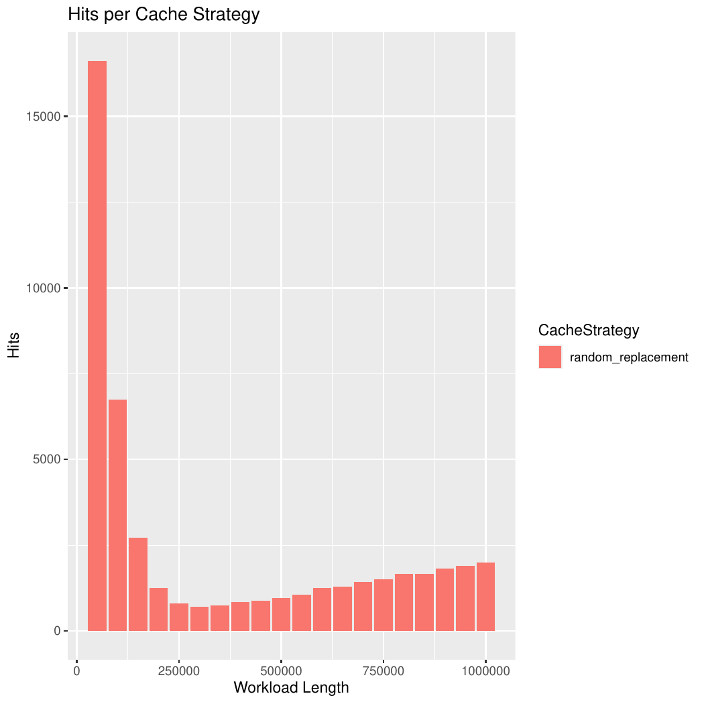
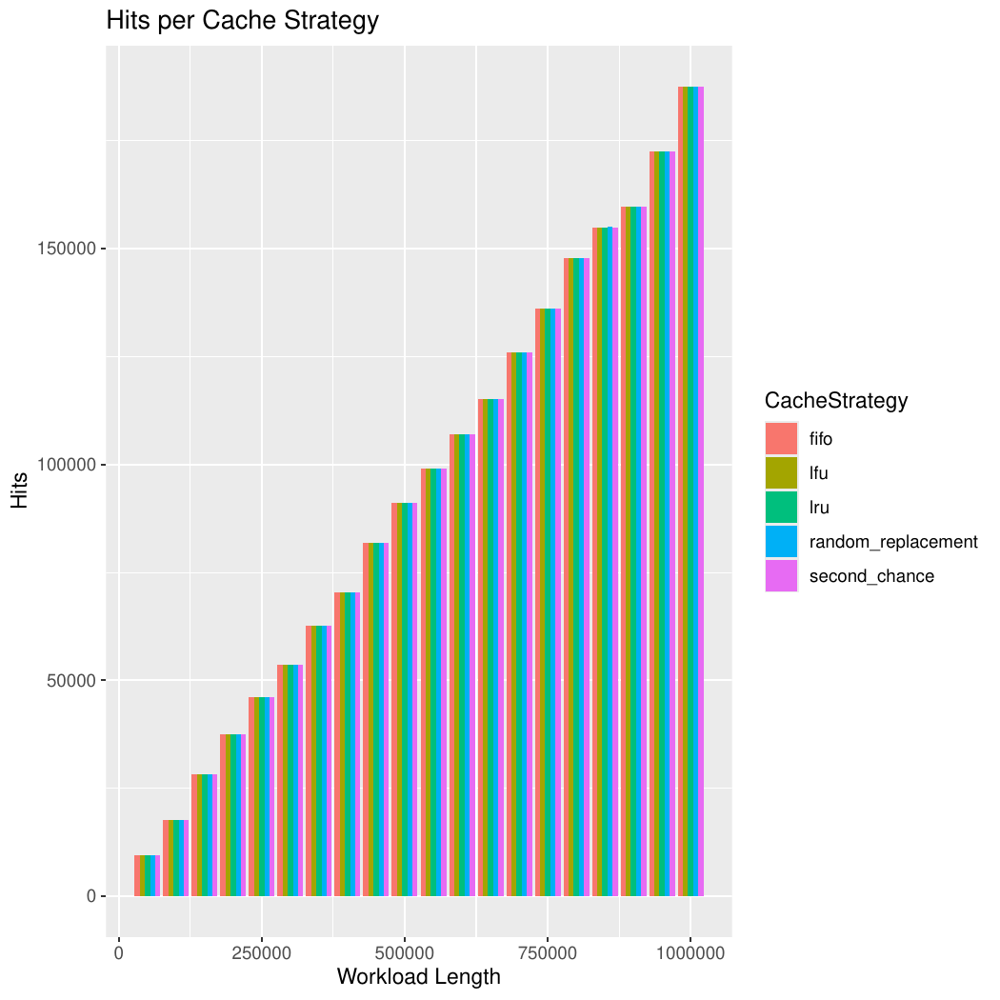

# _Random Replacement Eviction Strategy_

## Definição
A política _Random Replacement_ (RR) é uma estratégia de substituição de _cache_ que se caracteriza pela simplicidade e imprevisibilidade de sua execução. Seu funcionamento consiste em escolher, de forma aleatória e uniforme, qual elemento do _cache_ será removido quando ocorre um _miss_ em um _cache_ já cheio. Ou seja,
sempre que um novo elemento precisa ser inserido e não há espaço disponível, o algoritmo seleciona um dos dados armazenados com probabilidade igual e o substitui pelo novo valor. Essa abordagem dispensa o uso de informações sobre tempo de acesso, frequência ou ordem de chegada, diferentemente de políticas como _LRU_ (Least Recently Used) ou _FIFO_ (First In, First Out), que dependem da manutenção de estruturas auxiliares.
Essa simplicidade torna a _Random Replacement_ extremamente barata em termos de implementação, pois basta um gerador de números aleatórios e um mecanismo de substituição direta no array que representa o _cache_.

## Aplicações da _Random Replacement_

Um exemplo real de aplicação da política RR ocorre em sistemas de escalonamento de processos em sistemas operacionais, especialmente em ambientes com _workloads_ periódicos, como servidores que processam tarefas recorrentes de monitoramento ou coleta de dados. Nesses cenários, os processos chegam em intervalos regulares e têm demandas semelhantes de CPU, garantindo que cada tarefa receba sua fatia de tempo de execução de forma equitativa, sem que uma tarefa monopolize o processador. Dessa forma, a RR se mostra uma solução simples e eficaz para _workloads_ regulares e previsíveis.

## Implementação da estratégia de _cache_

A política _Random Replacement_ é implementada de forma bastante simples. O _cache_ é representado como uma estrutura de dados finita, normalmente um _ArrayList_. Para cada acesso, o algoritmo primeiro verifica se o elemento já está presente no _cache_. Caso esteja, ocorre um _hit_ e nenhuma modificação é necessária. Caso contrário, ocorre um _miss_. Se ainda houver espaço disponível, o elemento é inserido diretamente em uma posição livre. Se o _cache_ já estiver cheio, o algoritmo escolhe de maneira aleatória um índice entre os elementos atualmente armazenados e substitui o valor encontrado naquela posição pelo novo elemento requisitado.
Do ponto de vista computacional, o passo mais custoso é a verificação da presença do elemento no cache. Como o _cache_ é implementado como um _ArrayList_ simples, essa busca é feita de forma sequencial, exigindo no pior caso a varredura completa da estrutura.

```java
public boolean contains(T value) {
    return items.contains(value);
}
```

Assim, o custo desse procedimento é O(_m_), onde _m_ é o tamanho do cache. Em contrapartida, tanto a inserção em uma posição livre quanto a substituição aleatória são operações constantes, O(1)  já que envolvem apenas a geração de um número aleatório e a atualização de uma posição do _ArrayList_.

```java
	public void add(T value) {
		if (items.size() < capacity) {
			// Adiciona normalmente
			items.add(value);

			// Se após adicionar atingir a capacidade, sorteia o próximo a sair
			if (items.size() == capacity) {
				int idx = random.nextInt(items.size());
				nextEviction = items.get(idx);
			}
		} else {
			// Substitui o elemento guardado em nextEviction
			int idx = items.indexOf(nextEviction);
			items.set(idx, value);

			// Sorteia outro elemento aleatório como próximo a sair
			int newIdx = random.nextInt(items.size());
			nextEviction = items.get(newIdx);
		}
	}
````
Portanto, o tempo de execução por acesso é dominado pela busca no _cache_, resultando em uma complexidade de O(_m_). Para uma sequência de _n_ acessos, a complexidade 
global da execução é O(_n_ x _m_).

Antes de seguirmos, é importante fazer uma ressalva:

A RR poderia ser implementada utilizando um Hash em conjunto com um array, permitindo assim, um consulta ao cache em O(1), porém neste caso utilizariamos
muita memória auxiliar, o que acreditamos que fere a ideia do cache de ser uma memória de capacidade reduzida. 

## Desempenho da estratégia de _cache_
### _Periodic workload_

Aqui temos o resultado mais interessante da _Random Replacement_ : o fato de que, em determinadas situações, especialmente em _workloads_ periódicos e de pequena escala, uma política totalmente aleatória pode superar estratégias mais sofisticadas.
Esse comportamento chama a atenção justamente por ser inesperado — afinal, a intuição comum é que a aleatoriedade levaria a um maior número de _misses_ e a um pior aproveitamento do _cache_. No entanto, a RR mostra que, ao escapar de padrões rígidos de substituição, pode explorar uma vantagem probabilística em cenários cíclicos, evitando o ciclo determinístico observado em políticas como _FIFO_ e _LRU_. 

Observe abaixo o gráfico da quantidade de _hits_ por tamanho do workload:



O gráfico acima evidencia de forma clara o comportamento peculiar da _Random Replacement_ em _workloads_ periódicos. De maneira contraintuitiva, observa-se que a RR alcança um número de _hits_ significativamente maior nos _workloads_ menores e repetitivos, superando até mesmo estratégias mais sofisticadas.

Agora vamos entender o porquê desse comportamento nesse tipo de _workload_.

Premissas do modelo:
1.  A sequência de acessos é periódica e acessa sequencialmente _K_ itens distintos: 1, 2, 3 .. _K_, 1, 2, 3 .. _K_  
2.  O _cache_ tem tamanho fixo _M_ e está sempre cheio após a fase inicial.  
3.  Quando ocorre um _miss_, se o _cache_ está cheio, a RR escolhe aleatoriamente um dos _M_ valores para evicção (probabilidade 1/_M_ de evicção de qualquer elemento particular).

Com as premissas acima, vamos supor o seguinte cenário:

Considere um item _x_. Entre duas referências consecutivas a _x_ existem exatamente _K-1_ acessos a outros itens. Desses _K-1_ acessos, um subconjunto produzirá _misses_ (e portanto evicções).

Se o _cache_ contém _M_ itens e inclui _x_, então, entre os _K-1_ outros itens, há exatamente _K-M_ itens que não estão no _cache_ (porque o _cache_ armazena _M_ itens distintos, um deles é _x_, outros _M - 1_ estão no _cache_; assim dentre os _K-1_ restantes, _K -1-(M -1) = K - M_  causarão _misses_).

Cada um desses _K-M_  misses ocasiona uma evicção aleatória de um dos _M_ elementos.

Portanto, o número de evicções que ameaçam _x_ entre duas aparições de _x_ é exatamente _K-M_. Em cada uma dessas evicções a probabilidade de que _x_ seja escolhido e removido é _1 / M_.

Assumindo independência entre as evicções (aproximação válida pelo caráter aleatório da RR), a probabilidade de sobrevivência de _x_ até sua próxima referência é:

$$ P(\text{hit}) = \left(1 - \frac{1}{M}\right)^{K-M} $$

Ao analisarmos essa fórmula para $P(\text{hit})$, podemos tirar as seguintes conclusões:


* A base $1 - \frac{1}{M}$ é menor que 1, já que $M > 1$.
* Funções da forma $x^n$ com $0 < x < 1$ e $n > 0$ são decrescentes em relação a $n$, o que significa que quanto maior $K - M$, menor será $P(\text{hit})$.

Portanto, isso explica o porquê, para _workloads_ muito grandes, a função $P(\text{hit})$ acaba sendo degenerada: à medida que $K-M$ cresce, a probabilidade de acerto cai rapidamente. Em contraste, para _workloads_ menores, a diferença $K - M$ é menor, o que mantém $P(\text{hit})$ relativamente alta, permitindo que a política RR se destaque em relação às outras políticas analisadas, como pode ser observado no gráfico abaixo.


A partir do gráfico, podemos observar que, a longo prazo e para _workloads_ maiores, a política RR apresenta uma degradação significativa de desempenho, devido à rápida diminuição da probabilidade de acerto $P(\text{hit})$ conforme $K-M$ cresce. 
Nesse cenário, políticas mais sofisticadas, como _LFU_, mostram-se mais produtivas, mantendo uma taxa de acertos mais alta e consistente, evidenciando que a escolha da política de _cache_ deve considerar não apenas o tamanho do _cache_, mas também o tamanho e o perfil do _workload_.

### Analisando _hit time_ e _miss time_

Como já mencionado anteriormente, o custo predominante da política RR está associado à operação de consulta, que, no caso implementado, possui complexidade O(_M_).
Isso ocorre porque, para cada acesso, é necessário percorrer até _M_ elementos do _cache_ para verificar a presença do item, tornando o desempenho da política linear em função do tamanho do _cache_. Sendo assim, em termos de eficiência de consulta, a RR acaba sendo inferior a políticas como _LRU_ e _Second chance_, que conseguem manter operações de busca mais rápidas e escaláveis, especialmente em cenários com caches maiores e workloads intensivos.

Como demonstra o gráfico abaixo:


Portanto, apesar da política RR apresentar bom desempenho para _workloads_ periódicos e de tamanho reduzido, além de possuir uma implementação simples, é preciso considerar o trade-off das operações de consulta relativamente “lenta” em comparação a outras políticas, como _LRU_ e _Second chance_. 

Esse fator limita sua eficiência em _caches_ maiores ou em _workloads_ mais intensivos, ressaltando que a escolha da política de substituição deve equilibrar simplicidade de implementação e desempenho sob diferentes cenários.

### _Spike workload_

Quando analisamos a política RR em um _workload_ do tipo _spike_, caracterizado por picos súbitos e aleatórios de acessos ao _cache_, observa-se que, embora o desempenho médio se equipare ao de todas as políticas analisadas, a RR perde a previsibilidade de acerto $P(\text{hit})$.

Diferentemente de *workloads* periódicos, nos quais o $P(\text{hit})$ pode ser estimado com base na diferença $K-M$, os picos aleatórios tornam o comportamento do _cache_ mais volátil, dificultando a previsão da taxa de acertos, mesmo que a performance global ainda se mantenha comparável às outras políticas.

Observe que a taxa de _hit_ é praticamente idêntica de todas as políticas:



Apesar de o _hit rate_ ser praticamente idêntico ao de todas as políticas analisadas, a RR novamente é penalizada pelo custo de busca no cache, que permanece linear em função do tamanho _M_. Esse fator torna suas operações de consulta mais lentas em comparação a políticas mais sofisticadas, o que acaba descartando a RR como uma opção viável para esse tipo de workload com picos aleatórios, mesmo que sua probabilidade de acerto média seja semelhante.

Perceba como uma ida mal sucedida ao _cache_ é mais custosa para a RR:


Desse modo, percebe-se que o _workload_ do tipo _spike_ não é adequado para a política RR. Embora o desempenho médio, em termos de _hit rate_, seja praticamente idêntico ao das demais políticas, as constantes idas ao cache se tornam muito custosas devido ao custo linear de busca, tornando a RR uma opção menos eficiente nesse cenário de picos aleatórios.

### _Randomic workload_

Em _workloads_ randômicos, nos quais os acessos ao _cache_ ocorrem de forma totalmente imprevisível, a política RR se destaca levemente em relação às demais políticas analisadas.
Isso ocorre porque suas remoções são distribuídas de forma aleatória, evitando que certos itens sejam descartados de forma concentrada. Como resultado, a RR consegue manter uma cobertura ligeiramente melhor do conjunto de itens requisitados, garantindo um desempenho médio um pouco superior. Porém, isso não a torna tão eficiente quanto em workloads periódicos, nos quais o padrão de acessos permite uma estimativa mais previsível da probabilidade de acerto.


Perceba o custo de uma ida mal sucedida ao cache:


Desse modo, fica evidente que, para _workloads_ do tipo _randomic_, a RR , apesar de apresentar um _hit rate_ semelhante ao das outras políticas, acaba sendo menos eficiente, já que cada acesso ao _cache_ é mais custoso . Nesse contexto, a _LFU_, _LRU_ e _Second Cahnce_ se mostram mais vantajosas por realizarem buscas no _cache_ de forma mais barata, evidenciando a limitação da abordagem random diante de consultas randomicas.

## Conclusão

Em conclusão, a _Random Replacement_ apresenta comportamentos variados dependendo do tipo de _workload_. Para _workloads_ periódicos e de tamanho reduzido, ela pode oferecer desempenho competitivo devido à simplicidade da implementação e à previsibilidade da probabilidade de acerto $P(\text{hit})$.

No entanto, à medida que os _workloads_ se tornam maiores ou mais imprevisíveis, como em cenários de picos (_spike_) ou randômicos, a RR é limitada pelo custo linear de busca no _cache_ e pela perda de previsibilidade do _hit rate_. Embora possa se destacar levemente em _workloads_ randômicos, na prática esse ganho não compensa a penalização de tempo de consulta, tornando políticas como _LFU_, _LRU_ e _Second Chance_ mais eficientes e confiáveis em cenários com caches grandes ou acessos intensivos e irregulares.
