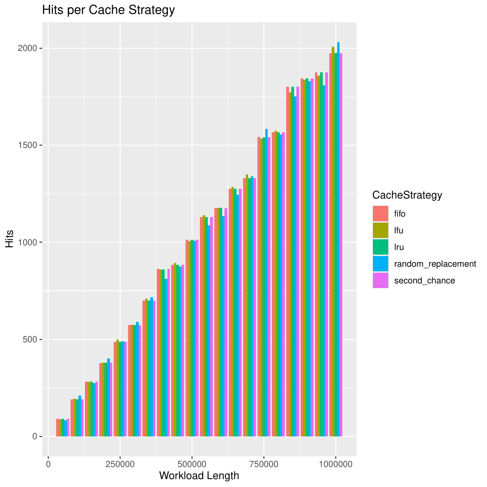

# _Second Chance Eviction Strategy_

## Definição
Em sistemas operacionais de memória virtual, é preciso, por vezes, recuperar dados de armazenamento secundário e lançá-los na memória principal. Tais dados são recuperados em blocos de tamanho fixo chamados páginas, também conhecidas como **páginas de memória** ou **memória virtual**.

O processo de **paginamento**, ou _swapping_, permite que, uma vez que um dado/página para o qual não existe referência na memória principal é requerido, uma exceção do tipo "falha de página" é lançada, e assim busca-se pela página na memória secundária, trazendo-a para o armazenamento principal.

Entretanto, é sabido que a memória _RAM_, apesar de possuir acesso rápido, é bastante limitada em relação à memória secundária, o que gera a necessidade de otimizar o espaço existente com páginas que possam ser re-acessadas com maior frequência. Nesse sentido, surgem estratégias/algoritmos de _page replacement_ que buscam, a princípio, diminuir a quantidade de _page faults_ - a necessidade de buscar páginas na memória secundária - e promover maior eficiência em termos de complexidade algorítmica e computacional. Uma delas é chamada de _Second Chance_.

## _Second Chance_ como estratégia de _cache_
É importante perceber que a utilização da estratégia de _Second Chance_ não se restringe apenas a sistemas operacionais que fazem uso de memória virtual. Nesse cenário, é possível adotar essa política para contextos gerais de _cache_, em que busca-se acesso rápido ao buscar elementos que, a princípio, estariam alocados em uma memória de acesso mais lento.

Dessa forma, a eficiência da política no contexto de _cache_ pode ser avaliada por uma série de critérios, desde análises quantitativas simples até observações técnicas complexas. É possível medir, portanto: em primeiro lugar, a quantidade de _hits_ da política, ou seja, quantas vezes um elemento buscado já estava em cache; em segundo, os tempos médios de _hit_ e _miss_, isto é, a quantidade de tempo demanadada pela estratégia para verificar que um elemento está ou não em cache, e inserí-lo se ele não estiver (removendo algum outro nesse processo, já que a memória destinada ao _cache_ é limitada).

No caso da política de _Second Chance_, esse processo é feito a partir da associação entre o valor a ser armazenado e um **_bit_ de referência**. Esse _bit_, 0 ou 1, indica majoritariamente se aquele valor associado deve ou não deixar a memória de _cache_.

## Implementação da estratégia de _cache_
Existem diversas implementações conhecidas para a política de _Second Chance_. Uma das mais difundidas entre estudiosos, programadores e desenvolvedores é conhecida como _clock_. Nessa implementação, a estrutura de cache é tratada como uma fila circular, com um ponteiro que indica sempre a próxima "vítima", ou seja, qual elemento será primeiro analisado em um cenário de evasão de cache. A natureza cíclica/circular desse apontador assemelha-se à de um ponteiro de relógio (_clock_), o qual dá nome à implementação.

Dessa forma, seguindo as regulações de _Second Chance_, todo elemento adicionado ao _cache_ tem, por natureza, _bit_ de referência 1. Isso indica que aquele elemento foi recentemente acessado e por isso não deve deixar o _cache_. A partir daí, e após a ocupação total da estrutura, consultas posteriores estarão sempre associadas ou à busca de um valor já armazenado em _cache_ (_hit_) ou à substituição de um valor por outro que não estava armazenado (_miss_).

No primeiro cenário, deve-se buscar o valor em questão no _cache_ e atualizar seu _bit_ de referência para 1, caso seja 0. Como já explicitado, tal manobra serve para indicar que o elemento em questão foi recentemente acessado e que por isso não deve deixar, a princípio, a memória. Por outro lado, no segundo cenário, deve-se, antes de tudo, acessar o elemento marcado como vítima. Verifica-se, então, se seu _bit_ de referência é 0. Em caso afirmativo, ele deixa o _cache_, abrindo espaço para outro elemento. Caso contrário, inicia-se uma travessia circular, a partir da vítima, buscando por algum valor associado a um _bit_ 0. É de extrema importância destacar que, nesse processo, todos aqueles elementos cujo bit de referência é igual a 1, têm seus bits setados para 0, o que indica a utilização da “segunda chance” que tiveram de permanecer armazenados no _cache_.

### Complexidade e eficiência
É bem verdade que a complexidade exata da implementação da política _Second Chance_ leva em consideração diversos fatores, como: estrutura de dados utilizada, máquina na qual os testes são aplicados, _Garbage Collector_ da linguagem utilizada na implementação etc. Consideraremos aqui nossa implementação, na qual um _Array_ foi utilizado como estrutura de dados base do _cache_, além de uma Tabela _Hash_, que associa cada elemento do cache a sua posição no _Array_.

Com tais informações, é possível concluir, à priori, um ponto importante: a busca por um elemento no cache possui complexidade _**O(1)**_, já que uma tabela _Hash_ é utilizada nesse processo. Assim, durante um _hit_, a complexidade da operação se aproxima de _**O(1)**_, já que tem-se dois processos principais envolvidos: a busca do elemento na tabela _Hash_ visando à obtenção de seu índice no _array_; a mudança de seu _bit_ de referência. 

Por outro lado, um _miss_ é precedido por uma sequência de operações que, a princípio, são mais custosas do que àquelas de _hit_. Isso se dá pelo fato de que, nesse caso, deve-se iterar por uma porção da lista de elementos até encontrar o primeiro elemento que deve deixar o _cache_ considerando seu _bit_ de referência. Esse processo possui ordem de complexidade linear _**O(n)**_, uma vez que, no pior caso, deve-se iterar por todo o _Array_ para determinar o valor a sair.

## Desempenho da estratégia de _cache_
### _Randomic Workload_
#### Quantidade de _hits_
No que tange à quantidade de _hits_ em _workloads randômicos, _Second Chance_ possui uma quantidade **crescente** de _hits_ à medida que a magnitude da carga aumenta. Seu comportamento, nesse caso, é bastante similar ao de outras políticas como _LFU_ (_Least Frequently Used_) e _LRU_ (_Least Recently Used_). Vale destacar, nesse cenário que, apesar de a quantidade de _hits_ ser crescente, os valores são inferiores se comparados aos de outros _workloads_, já que, para valores totalmente aleatórios (ou pseudoaleatórios), a **probabilidade** de se consultar um elemento já em _cache_ é substancialmente pequena.

O gráfico a seguir retrata a comparação das quantidades de _hits_ por **política de _cache_** em _workloads_ totalmente randômicos:

