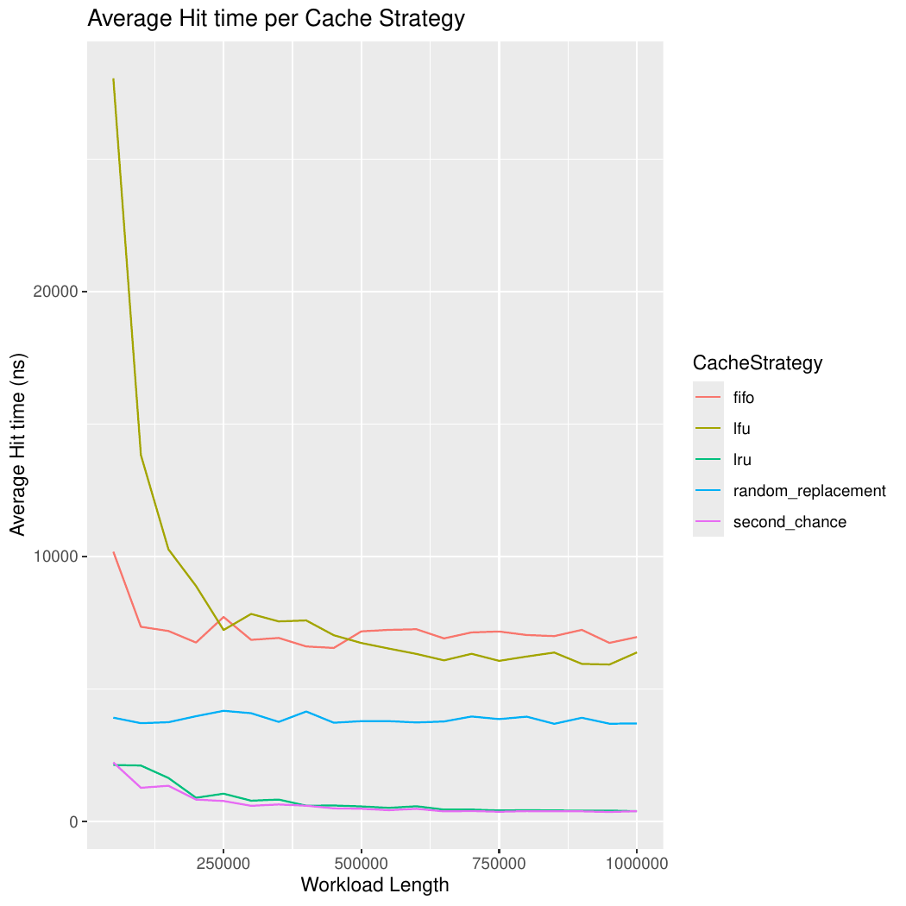
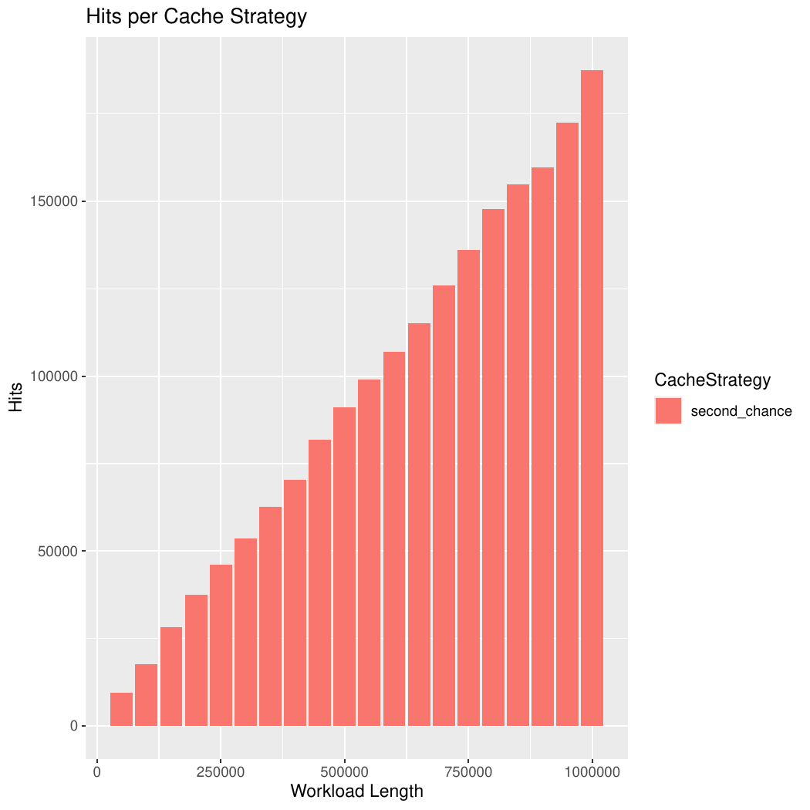
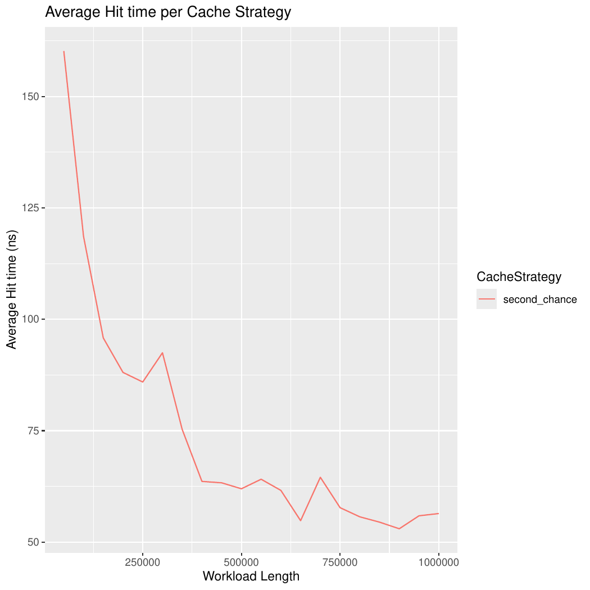
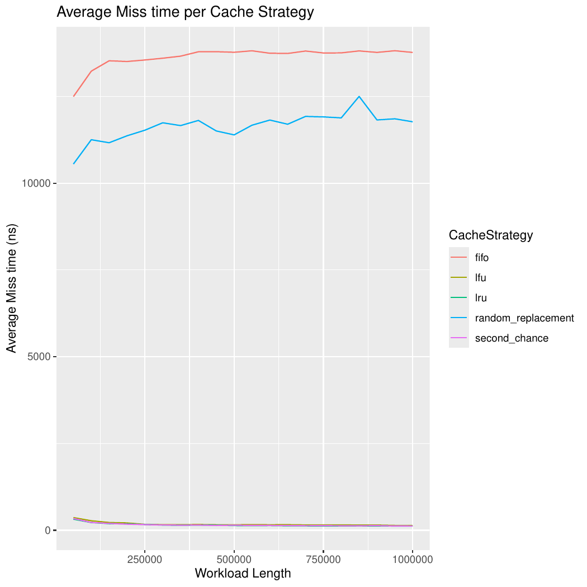

# _Second Chance Eviction Strategy_

  - [Definição](#definição)
  - [_Second Chance_ como estratégia de _cache_](#second-chance-como-estratégia-de-cache)
  - [Implementação da estratégia de _cache_](#implementação-da-estratégia-de-cache)
  - [Variações dentro da estratégia](#variações-dentro-da-estratégia)
  - [Complexidade e eficiência](#complexidade-e-eficiência)
  - [Desempenho da estratégia de _cache_](#desempenho-da-estratégia-de-cache)
  - [_Randomic workload_](#randomic-workload)
  - [_Periodic workload_](#periodic-workload)
  - [_Spike_workload_](#spike-workload)
  - [Conclusão](#conclusão)
  - [Autor](#autor)

## Definição
Em sistemas operacionais de memória virtual, é preciso, por vezes, recuperar dados de armazenamento secundário e lançá-los na memória principal. Tais dados são recuperados em blocos de tamanho fixo chamados páginas, também conhecidas como **páginas de memória** ou **memória virtual**.

O processo de **paginação**, ou _swapping_, permite que, uma vez que um dado/página para o qual não existe referência na memória principal é requerido, uma exceção do tipo "falha de página" é lançada, e assim busca-se pela página na memória secundária, trazendo-a para o armazenamento principal.

Entretanto, é sabido que a memória _RAM_, apesar de possuir acesso rápido, é bastante limitada em relação à memória secundária, o que gera a necessidade de otimizar o espaço existente com páginas que possam ser re-acessadas com maior frequência. Nesse sentido, surgem estratégias/algoritmos de _page replacement_ que buscam, a princípio, diminuir a quantidade de _page faults_ - a necessidade de buscar páginas na memória secundária - e promover maior eficiência em termos de complexidade algorítmica e computacional. Uma delas é chamada de _Second Chance_.

## _Second Chance_ como estratégia de _cache_
É importante perceber que a utilização da estratégia de _Second Chance_ não se restringe apenas a sistemas operacionais que fazem uso de memória virtual. Nesse cenário, é possível adotar essa política para contextos gerais de _cache_, em que busca-se acesso rápido ao buscar elementos que, a princípio, estariam alocados em uma memória de acesso mais lento.

Dessa forma, a eficiência da política no contexto de _cache_ pode ser avaliada por uma série de critérios, desde análises quantitativas simples até observações técnicas complexas. É possível medir, portanto: em primeiro lugar, a quantidade de _hits_ da política, ou seja, quantas vezes um elemento buscado já estava em cache; em segundo, os tempos médios de _hit_ e _miss_, isto é, a quantidade de tempo demanadada pela estratégia para verificar que um elemento está ou não em cache, e inserí-lo se ele não estiver (removendo algum outro nesse processo, já que a memória destinada ao _cache_ é limitada).

No caso da política de _Second Chance_, esse processo é feito a partir da associação entre o valor a ser armazenado e um **_bit_ de referência**. Esse _bit_, 0 ou 1, indica majoritariamente se aquele valor associado deve ou não deixar a memória de _cache_.

É possível analisar, ainda, nesse contexto: o _**Miss Penalty**_ da política de _cache_, ou seja, o quanto um _miss_ pune, no que tange a tempo de execução, a eficiência da estratégia; o seu _**Overhead**_ , que, de maneira geral, mede o impacto de uma estrutura de dados no desempenho da política de _cache_.

## Implementação da estratégia de _cache_
Existem diversas implementações conhecidas para a política de _Second Chance_. Uma das mais difundidas entre estudiosos, programadores e desenvolvedores é conhecida como _clock_. Nessa implementação, a estrutura de cache é tratada como uma fila circular, com um ponteiro que indica sempre a próxima "vítima", ou seja, qual elemento será primeiro analisado em um cenário de evasão de cache. A natureza cíclica/circular desse apontador assemelha-se à de um ponteiro de relógio (_clock_), o qual dá nome à implementação.

Dessa forma, seguindo as regulações de _Second Chance_, todo elemento adicionado ao _cache_ tem, por natureza, _bit_ de referência 1. Isso indica que aquele elemento foi recentemente acessado e por isso não deve deixar o _cache_. A partir daí, e após a ocupação total da estrutura, consultas posteriores estarão sempre associadas ou à busca de um valor já armazenado em _cache_ (_hit_) ou à substituição de um valor por outro que não estava armazenado (_miss_).

No primeiro cenário, deve-se buscar o valor em questão no _cache_ e atualizar seu _bit_ de referência para 1, caso seja 0. Como já explicitado, tal manobra serve para indicar que o elemento em questão foi recentemente acessado e que por isso não deve deixar, a princípio, a memória. Por outro lado, no segundo cenário, deve-se, antes de tudo, acessar o elemento marcado como vítima. Verifica-se, então, se seu _bit_ de referência é 0. Em caso afirmativo, ele deixa o _cache_, abrindo espaço para outro elemento. Caso contrário, inicia-se uma travessia circular, a partir da vítima, buscando por algum valor associado a um _bit_ 0. É de extrema importância destacar que, nesse processo, todos aqueles elementos cujo bit de referência é igual a 1, têm seus bits setados para 0, o que indica a utilização da “segunda chance” que tiveram de permanecer armazenados no _cache_. Em ambos os casos de _miss_, o apontador circular _clock_ é deslocado uma posição para a frente, indicando uma mudança na "vítima".

### Variações dentro da estratégia
Vale destacar que a inicialização do _bit_ de referência logo após sua inserção no _cache_ pode seguir duas convenções distintas. A primeira delas defende a inserção com _bit_ de referência **1** e assume que o valor adicionado já deve ser inserido com "crédito" na memória, isto é, com o direito de segunda chance garantido, já que foi acessado recentemente. Por outro lado, é possível encontrar materiais que referenciam a inserção com _bit_ **0**, argumentando que o elemento recém inserido deve "provar" mais uma vez que é recentemente acessado para garantir seu direito a segunda chance. Na prática, a segunda abordagem torna o algoritmo mais direto do ponto de vista de **evicções**, já que remove diretamente valores que não possuem, a curtíssimo prazo, recência de acesso.

Em nosso projeto, implementamos _Second Chance_ seguindo a primeira convenção, segundo a qual elementos recém-inseridos possuem _bit_ de referência **1**.

### Complexidade e eficiência
É bem verdade que a complexidade exata da implementação da política _Second Chance_ leva em consideração diversos fatores, como: estrutura de dados utilizada, máquina na qual os testes são aplicados, _Garbage Collector_ da linguagem utilizada na implementação etc. Consideraremos aqui nossa implementação, na qual um _Array_ foi utilizado como estrutura de dados base do _cache_, além de uma Tabela _Hash_, que associa cada elemento do cache a sua posição no _Array_.

Com tais informações, é possível concluir, à priori, um ponto importante: a busca por um elemento no cache possui complexidade _**O(1)**_, já que uma tabela _Hash_ é utilizada nesse processo. Assim, durante um _hit_, a complexidade da operação se aproxima de _**O(1)**_, já que tem-se dois processos principais envolvidos: a busca do elemento na tabela _Hash_ visando à obtenção de seu índice no _array_; a mudança de seu _bit_ de referência. 

Por outro lado, um _miss_ é precedido por uma sequência de operações que, a princípio, são mais custosas do que àquelas de _hit_. Isso se dá pelo fato de que, nesse caso, deve-se iterar por uma porção da lista de elementos até encontrar o primeiro elemento que deve deixar o _cache_ considerando seu _bit_ de referência. Esse processo possui ordem de complexidade linear _**O(n)**_, uma vez que, no pior caso, deve-se iterar por todo o _Array_ para determinar o valor a sair.

É importante destacar, do ponto de vista de implementação, que em cada posição de nosso _Array_, existe um objeto do tipo _SecondChanceEntry<T>_, que evolve tanto o valor genérico a ser armazenado em _cache_ quanto o _bit_ de referência na forma de um _boolean_ simples. Aqui está a implementação em Java:

```Java
public class SecondChanceEntry<T> {

    private T value;

    private boolean evictionable;

    public SecondChanceEntry(T value) {
        this.value = value;
        this.evictionable = false;
    }

    public T getValue() {
        return this.value;
    }

    public boolean isEvictionable() {
        return this.evictionable;
    }

    public void setValue(T value) {
        this.value = value;
    }

    public void setEvictionable(boolean evictionable) {
        this.evictionable = evictionable;
    }

}
```

## Desempenho da estratégia de _cache_
### _Randomic Workload_
#### Quantidade de _hits_
No que tange à quantidade de _hits_ em _workloads_ randômicos, _Second Chance_ possui uma quantidade **crescente** de _hits_ à medida que a magnitude da carga aumenta. Seu comportamento, nesse caso, é bastante similar ao de outras políticas como _LFU_ (_Least Frequently Used_) e _LRU_ (_Least Recently Used_). Vale destacar que nesse cenário, apesar de a quantidade de _hits_ ser crescente, os valores são inferiores se comparados aos de outros _workloads_, já que, para valores totalmente aleatórios (ou pseudoaleatórios), a **probabilidade** de se consultar um elemento já em _cache_ é substancialmente pequena.

O gráfico a seguir retrata a comparação das quantidades de _hits_ por **política de _cache_** em _workloads_ totalmente randômicos:


#### Tempo médio de _hit_
Comparado ao de outras políticas abordadas nesse material, o tempo médio de _hit_ de _Second Chance_ é mais eficiente. Isso se deve sobretudo à ordem de complexidade atrelada a busca por um elemento em _cache_. No caso da _Second Chance_, essa busca é _**O(1)**_, já que uma tabela _Hash_ é utilizada para associar cada elemento a alguma posição no _Array_ que serve de base para o cache. Dessa forma, o _**contains(T value)**_ nada mais é do que um método _**containsKey(T value)**_ aplicado a um _HashMap_ de Java.

```Java
public boolean contains(T value) {
  return this.indexMap.containsKey(T value);
}
```
É interessante observar que os tempos médios de _hit_ de _Second Chance_ são bastante próximos dos tempos médios da política _LRU_. Isso se dá majoritariamente pela utilização, em ambas as estratégias, de tabelas _Hash_ como estruturas de dados para busca de elementos. No entanto, _Second Chance_ possui constantes menores em virtude da baixa quantidade de operações subsequentes à verificação da chave na tabela _Hash_. O seguinte gráfico ilustra esse comportamento:


É interessante observar, ainda, a existência de uma curvatura considerável no gráfico de tempo médio de _hit_ de _Second Chance_. Tal curvatura pode ser justificada a partir de uma análise estatística. Em _workloads_ pequenos, especialmente em cargas randômicas, a quantidade de _hits_ é menor. Isso significa que qualquer alteração em uma métrica de _hit_ (a qual ocorre, eventualmente) é suficiente para deslocar a média para cima, neste caso. Portanto, conforme as cargas aumentam, a quantidade de _hits_ que seguem a complexidade esperada - _O(1)_ - aumenta, diluindo os _hits_ custosos e eventuais. Uma versão **ampliada** e **individual** do gráfico de tempo médio de _hit_ para _Second Chance_ encontra-se aqui:


#### Tempo médio de _miss_
Em se tratanto de tempo médio de _miss_, a política de _Second Chance_ se sai bem conforme o comprimento dos workloads aumenta de forma contínua. Isso ocorre em virtude de uma propriedade bastante interessante dessa estratégia referente a complexidade linear de um _miss_. Como abordado em tópicos anteriores, no caso em que o valor buscado não está em _cache_, deve-se iterar pela lista de elementos, partindo daquele marcado como **vítima**, e buscando dados cujo bit de referência seja **0**. Naturalmente, esse processo possui complexidade _**O(n)**_, já que, no pior caso, itera-se por **toda** a estrutura até encontrar um elemento que cumpra esse requisito.

O grande ponto de _Second Chance_ é que os casos em que a iteração por toda a estrutura é necessária são bastante específicos, de modo que a eficiência das muitas iterações que não percorrem todo o _Array_ "sufoca" a ineficiência das travessias custosas, criando um cenário conhecido como _**O(n)**_ diluído. É importante destacar que o fato de _Second Chance_ utilizar um apontador (_clockPointer_) circular faz com que a busca pelo elemento _evictionable_ nunca (ou quase nunca) tenha que começar do início da fila, o que degeneraria o algoritmo para _**O(n)**_ puro. Ademais, durante a travessia, vários dos _bits_ são _setados_ para 0, como já exposto. Isso permite que as vítimas finais, isto é, os elementos que de fato deixam o _cache_, sejam encontradas com extrema facilidade, em tempo distante de _**O(n)**_ e próximo de _**O(1)**_.

Formalmente, portanto, o que tem-se aqui é o conceito conhecido em Computação como _**O(1)**_ amortizado, em que a quantidade de operações da ordem _O(1)_ é consideravelmente maior do que o número de processos _O(n)_, o que resulta em uma complexidade geral _**≈ O(1)**_. Na prática, o que percebe-se aqui é:

$`T(n) = ... + O(1) + O(1) + O(1) + O(1) + O(1) + O(n) + ... + O(1) + O(1) + O(n)  \approx O(1)`$

Segue um trecho de nossa implementação, em Java, desse processo:
```Java
    public void add(T value) {

        if (this.isFull()) {

            int idxEvictionable = indexOfNextEvictionable();

            this.indexMap.remove(this.entryCache[idxEvictionable].getValue());

            this.entryCache[idxEvictionable].setValue(value);

            this.entryCache[idxEvictionable].setEvictionable(false);

            this.indexMap.put(value, idxEvictionable);

            clockPointer = (idxEvictionable + 1) % this.entryCache.length;

        } else {

            this.entryCache[++this.last].setValue(value);

            this.indexMap.put(value, this.last);

        }

    }

```

Antes de tudo, verifica-se se o _cache_ está cheio. Em caso negativo, apenas adiciona-se o elemento na próxima posição livre e atualiza-se o _HashMap_ auxiliar. Caso contrário, modifica-se a posição do _Array_ retornada por _**indexOfNextEvictionable()**_, método que, ao iterar pela lista de valores, atualiza os _bits_ de referência. Atualiza-se, então, o _HashMap_ auxilixar e o valor da posição em questão do array. Por fim, corrije-se o valor de _clockPointer_, o nosso ponteiro circular que indica a próxima vítima. Aqui está a implementação do método _indexOfNextEvictionable()_:

```Java
    private int indexOfNextEvictionable() {

        if (this.isEmpty())
            throw new NoSuchElementException();

        int idx = clockPointer;

        while (!this.entryCache[idx].isEvictionable()) {
            this.entryCache[idx].setEvictionable(true);
            idx = (idx + 1) % this.entryCache.length;
        }

        return idx;

    }

```
Graficamente, o comportamento dos tempos médios de _miss_ de _Second Chance_ em _workloads_ puramente randômicos é:


### _Periodic workload_
#### Quantidade de _hits_
Assim como no _workload_ randômico, tem-se aqui um aumento contínuo da quantidade de hits conforme a magnitude da carga de dados cresce. É importante notar, entretanto, que a quantidade de _hits_ é maior se comparada às métricas para cargas randômicas de mesmo comprimento. Isso reforça o caráter periódico do _workload_, que replica uma sequência de valores aleatórios várias vezes em intervalos de tempo iguais, criando periodicidade.

Em uma comparação com as demais estratégias de _cache_, _Second Chance_ possui um desempenho regular, ainda que inferior a _Random Replacement_, para _workloads_ de tamanhos específicos, e _LFU_, em todos os tamanhos.

#### Tempo médio de _hit_
Mais uma vez, _Second Chance_ se mostra eficiente em relação ao tempo médio de _hit_, obtendo bom desempenho em todos os tamanhos de workload. O gráfico a seguir apresenta uma comparação de tempo médio de _hit_ entre todas as políticas abordadas no projeto para _workloads_ periódicos.



É importante notar que apesar de esse gráfico, para a _Second Chance_, ser similar ao gráfico de tempos médios de _hit_ para _workloads_ randômicos, observa um pico no último gráfico. Na faixa de tamanho de _workload_ entre 50.000 e 250.000 elementos a curva de cargas periódicas tem acentuação maior. A princípio, a justificativa é a mesma utilizada para explicar o formato curvo do gráfico em _workloads_ randômicos. No entanto, no caso periódico, há uma diferença substancial: a quantidade de _hits_ é **maior**.


Note que, em _workloads_ com 1 milhão de elementos, _Second Chance_ possui aproximadamente 2.300 _hits_ no caso periódico contra menos de 2000 no fluxo randômico; possui quase 1300 _hits_ para 500.000 elementos periódicos contra menos de 1000 em 500.000 randômicos. Uma vez que já foi compreendido que, em cargas de comprimento menor, poucos _hits_ custosos influenciam a média geral, é possível concluir que um número maior de _hits_ nesse intervalo de comprimento - o que pressupõe mais _hits_ cujo custo foge do padrão - lançaria ainda mais a média para cima, gerando um pico maior.

É razoável assumir, portanto, que o pico maior observado na curva de _workloads_ periódicos está estritamente relacionado tanto com a quantidade maior de _hits_ quanto com a existência de _hits_ eventuais que custam caro.

De forma conclusiva, apesar de possuir boas métricas de tempo, _Second Chance_ não possui as melhores assertividades - em termos de quantidade de _hits_ - entre as estratégias de _cache_ para _workloads_ periódicos. Isso ocorre pois apesar de considerar a recência de acesso e busca, o mecanismo de priorização de elementos recentes é mais primitivo do que aqueles de políticas como _LRU_, por exemplo.

#### Tempo médio de _miss_
Quando se trata de tempo médio de _miss_, _Second Chance_ acumula boas métricas. Seus dados reforçam, ainda, o comportamento de _**O(1)**_ amortizado que constitui sua operação de _miss_. Sendo assim, observa-se novamente o comportamento curvo do gráfico, com médias de tempos maiores em _workloads_ de menor comprimento, já que, nessas cargas de teste, os "_**O(n)**_ eventuais" analisados sobem a média geral de tempo. O gráfico a seguir exemplifica essa situação:


### _Spike workload_
#### Quantidade de _hits_
Nesse tipo de _workload_, _Second Chance_, e as outras políticas também, atingem seu melhor desempenho em relação à quantidade de _hits_. Para efeito de comparação, em um _workload_ de picos de 500.000 elementos, _Second Chance_ atinge pouco menos de **100.000** _hits_. Isso é quase **100** vezes maior do que a quantidade de _hits_ obtidos por essa mesma política em um _workload_ periódico de comprimento semelhante. Aqui vai uma exemplificação gráfica para a quantidade de _hits_ de _Second Chance_ em _workloads_ de picos:




#### Tempo médio de _hits_
Aqui, a análise estatística fica interessante. Seguindo a lógica do tempo médio de _hit_ para _workloads_ periódicos, era de se esperar que o pico de tempo no começo do gráfico de tempo médio de _hit_ para _Second Chance_ com **picos** fosse **maior**, certo? **NÃO!** O que temos aqui não é que a quantidade de _hits_ em _spike_ é maior. Ela é **muito** maior. Isso significa que, na prática, apesar de existirem mais _hits_ que destoam da complexidade padrão esperada, a quantidade de "_hits_ comuns" é tão elevada que suprime quaisquer tentativas de elevação brusca e acentuada da média. Consideremos que:

$`Tmedio =  \frac{Ttotal}{hits}`$

Isso significa que se _**hits**_ aumenta de forma demasiada, _Tmedio_ acaba caindo.

Aqui está a representação gráfica:



Percebe-se que o pico ainda existe, mas com médias de tempo **substancialmente menores**.

#### Tempo médio de _miss_
Nessa análise, a escolha da estrutura de dados _Array_ faz toda a diferença. É sabido que, ao inicializar um _Array_ de _x_ posições, por exemplo, são alocadas _x_ posições **contíguas**, isto é, contínuas/consecutivas, na memória.


Tal característica permite ao _Array_ ser uma estrutura naturalmente **indexada**, de modo que é possível acessar uma posição arbitrária em tempo constante, _**O(1)**_, já que é necessário apenas uma operação de soma para isso. Dessa forma, é razoável assumir que sair de uma posição conhecida do _Array_ para outra qualquer possui complexidade também costante, já que, mais uma vez, apenas uma operação aritmética é requerida.

Fazendo um paralelo agora, em uma _Linked List_, que não é naturalmente indexada, o acesso arbitrário é _**O(n)**_, já que, no pior caso, itera-se sobre todos os elementos da estrutura até encontrar aquele na posição desejada. Apessar disso, acessar um nó a partir de outro anterior ou posterior é _**O(1)**_, já que obtém-se apenas o valor de algum apontador.


Apesar de o acesso a posições subsequentes ser _**O(1)**_ em ambas as estruturas, as constantes de acesso no _Array_ são menores, pois as posições estão contíguas na memória, enquanto na _Linked List_ cada _Node_ pode estar em posições completamente opostas no armazenamento primário. Esse fato torna a operação de acesso em _Arrays_ levemente mais eficiente.

Nesse sentido, ao observar as métricas de tempo médio de _miss_ para todas as políticas, em workloads com _spikes_ (picos), percebe-se que _Second Chance_ possui desempenho bastante similar às políticas _LFU_ e _LRU_.



Mais do que isso, observa-se também que a curva que representa _Second Chance_ está sempre levemente **abaixo** das curvas de _LRU_ e _LFU_, o que sugere tempo médio de _miss_ levemente menor. E aqui entram os conceitos fundamentais de **Estruturas de Dados**. As estruturas de dados base usadas por _LFU_ e _LRU_ em nossas implementações são **Tabela _Hash_** (na forma de _HashMap_) e **_Linked List_**, enquanto _Second Chance_ está fundamentada em _Array_. Isso significa que apesar de a operação de _miss_ em todas essas três políticas possuir complexidade _**O(1)**_, _Second Chance_ possui constantes menores. Assim, durante as iterações pela lista de elementos, o acesso a posições de _Array_ é mais eficiente do que o acesso em _Linked List_ e Tabelas _Hash_.

Isso explica a vantagem leve de _Second Chance_ em relação a outras estratégias de _cache_ nesse cenário.

## Conclusão
Conclui-se, portanto, que a estratégia de _Second Chance_ constitui uma política consideravelmente boa em cenários em que requer-se um algoritmo simples e fácil de implementar e manter, além de ser uma estratégia que considera recência e frequência, ainda que de formas primitivas. É válido destacar, ainda, que para _workloads_ com picos de acesso, como processos repetidamente executados de forma abrupta, ou um _site_ acessado com muita frequência em um dia, _Second Chance_ se sai bem tanto em assertividade (quantidade de _Hits_) quanto em eficiência de tempo, possuindo _Miss Penalty_ e _Overhead_ satisfatórios.

Por fim, é válido pontuar que a gama de implementações possíveis para a _Second Chance_ é vasta. Uma delas, conhecida como _**Clock-Pro**_ - que sugere um aprimoramento da implementação _Clock_ - considera a distinção entre _Hot items_ e _Cold items_, o que auxilia no ganho de desempenho do _cache_.

## Autor
Guilherme Noronha (Github: [@guinoronhaf](https://github.com/guinoronhaf))


Este arquivo faz parte do projeto final da Disciplina de Estruturas de Dados e Algoritmos e Laboratório de Estruturas de Dados e Algoritmos do Curso de Ciência da Computação da Universidade Federal de Campina Grande durante o período 2025.1.
